# 2-semi-hyun-community-fe
우당탕탕 커뮤니티
## 0. 정리
- [2-semi-hyun-community-fe](https://github.com/100-hours-a-week/2-semi-hyun-community-fe)
- [2-semi-hyun-community-be](https://github.com/100-hours-a-week/2-semi-hyun-community-be)
- 
## 1. 스택
HTML, CSS, JavaScript

## 2. 기능
- 사용자 별 게시글 작성/수정/삭제 기능 구현
- 게시글 댓글 기능을 통해 상호작용 가능
- 나만의 닉네임을 가져봐요★
  
## 3. 폴더구조
```
2-semi-hyun-community-fe
├─ app.js
├─ package-lock.json
├─ package.json
├─ public
│  ├─ CSS
│  │  ├─ addpost.css
│  │  ├─ dashboard.css
│  │  ├─ default.css
│  │  ├─ default_profile.css
│  │  ├─ editPassword.css
│  │  ├─ editProfile.css
│  │  ├─ login.css
│  │  └─ viewPost.css
│  ├─ HTML
│  │  ├─ AddPost.html
│  │  ├─ DashBoard.html
│  │  ├─ EditPassword.html
│  │  ├─ EditPost.html
│  │  ├─ EditProfile.html
│  │  ├─ Login.html
│  │  ├─ SignUp.html
│  │  └─ ViewPost.html
│  └─ JS
│     ├─ DashBoard
│     │  ├─ API
│     │  │  ├─ AddPostFetch.js
│     │  │  ├─ CommentFetch.js
│     │  │  ├─ DashboardDataFetch.js
│     │  │  ├─ DeletePostFetch.js
│     │  │  ├─ LikeFetch.js
│     │  │  ├─ PatchPostFetch.js
│     │  │  └─ ViewPostFetch.js
│     │  └─ features
│     │     ├─ AddPostFunction.js
│     │     ├─ DashboardFunction.js
│     │     ├─ PostIdManager.js
│     │     └─ urlUtils.js
│     ├─ Login
│     │  ├─ API
│     │  │  ├─ LoginFetch.js
│     │  │  └─ SignUpFetch.js
│     │  └─ features
│     │     └─ LoginEmailCheck.js
│     └─ Users
│        ├─ API
│        │  ├─ getHeaderImage.js
│        │  ├─ getUserData.js
│        │  ├─ patchPassword.js
│        │  └─ patchUserData.js
│        └─ features
│           ├─ EditPwCheck.js
│           └─ ProfileImage.js
└─ README.md

```

## 4. 파일 구조

