# 🏡 우당탕탕 커뮤니티

우당탕탕 커뮤니티는 사용자들이 자유롭게 소통하고 의견을 공유할 수 있는 **커뮤니티 서비스**입니다.

## 🚀 프로젝트 개요
### 📌 깃허브 레포지토리
- **프론트엔드:** [🔗 링크](https://github.com/100-hours-a-week/2-semi-hyun-community-fe)
- **백엔드:** [🔗 링크](https://github.com/100-hours-a-week/2-semi-hyun-community-be)

### 🛠️ 기술 스택
- **프론트엔드:** HTML, CSS, JavaScript
- **백엔드:** Express.js, Node.js
- **데이터베이스:** MySQL


## 🔥 주요 기능
### 🏠 회원 시스템
- **회원가입 및 로그인:** 사용자는 계정을 생성하고 로그인하여 커뮤니티에 참여할 수 있습니다.
- **닉네임 설정:** 자신만의 개성 있는 닉네임을 설정할 수 있습니다.

### 📝 게시판 기능
- **게시글 관리:** 사용자 별로 게시글을 작성, 수정, 삭제할 수 있습니다.
- **댓글 시스템:** 게시글에 댓글을 남겨 상호작용할 수 있습니다.
- **좋아요 기능:** 게시글에 공감할 수 있도록 좋아요를 누를 수 있습니다.

### 🔒 보안
- **세션/쿠키 기반 인증** 서버에 사용자 정보를 저장하고, 쿠키를 통해 인증 정보를 전달합니다.

## 📖 실행방법
``` bash
# 의존성 설치
npm install

# app.js 실행
node app.js

```
  
##  📁 폴더구조
```
2-semi-hyun-community-fe
├─ app.js
├─ package-lock.json
├─ package.json
├─ public
│  ├─ Animation
│  │  ├─ like.json
│  │  └─ loading.json
│  ├─ config
│  │  ├─ config.js
│  │  └─ constants.js
│  ├─ CSS
│  │  ├─ addpost.css
│  │  ├─ dashboard.css
│  │  ├─ default.css
│  │  ├─ default_profile.css
│  │  ├─ editPassword.css
│  │  ├─ editProfile.css
│  │  ├─ login.css
│  │  └─ viewPost.css
│  ├─ Font
│  │  ├─ Moneygraphy-Pixel.woff2
│  │  └─ Moneygraphy-Rounded.woff2
│  ├─ HTML
│  │  ├─ AddPost.html
│  │  ├─ DashBoard.html
│  │  ├─ EditPassword.html
│  │  ├─ EditPost.html
│  │  ├─ EditProfile.html
│  │  ├─ Login.html
│  │  ├─ SignUp.html
│  │  └─ ViewPost.html
│  ├─ JS
│  │  ├─ DashBoard
│  │  │  ├─ API
│  │  │  │  ├─ AddPostFetch.js
│  │  │  │  ├─ CommentFetch.js
│  │  │  │  ├─ DashboardDataFetch.js
│  │  │  │  ├─ DeletePostFetch.js
│  │  │  │  ├─ LikeFetch.js
│  │  │  │  ├─ PatchPostFetch.js
│  │  │  │  └─ ViewPostFetch.js
│  │  │  └─ features
│  │  │     ├─ AnimationLike.js
│  │  │     ├─ AnimationLoading.js
│  │  │     ├─ BackButton.js
│  │  │     ├─ DashboardFunction.js
│  │  │     ├─ PostFunction.js
│  │  │     ├─ PostIdManager.js
│  │  │     └─ urlUtils.js
│  │  ├─ Login
│  │  │  ├─ API
│  │  │  │  ├─ checkEmailDuplicate.js
│  │  │  │  ├─ checkNameDuplicate.js
│  │  │  │  ├─ LoginFetch.js
│  │  │  │  ├─ LogoutFetch.js
│  │  │  │  └─ SignUpFetch.js
│  │  │  └─ features
│  │  │     ├─ EmailCheck.js
│  │  │     ├─ EmailCheckLogin.js
│  │  │     ├─ EmailCheckSignUp.js
│  │  │     ├─ EnableSignUpButton.js
│  │  │     ├─ NameCheck.js
│  │  │     ├─ SignupPwCheck.js
│  │  │     └─ ValidationState.js
│  │  └─ Users
│  │     ├─ API
│  │     │  ├─ deleteUserFetch.js
│  │     │  ├─ getHeaderImage.js
│  │     │  ├─ getUserData.js
│  │     │  ├─ patchPassword.js
│  │     │  └─ patchUserData.js
│  │     └─ features
│  │        ├─ EditPwCheck.js
│  │        ├─ EnableEditButton.js
│  │        └─ ProfileImage.js
│  └─ terms
│     ├─ privacyPolicy.html
│     └─ termsOfService.html
├─ .gitignore
│  
└─ README.md

```

## 📂 파일 구조


## 📌 향후 개선 사항
- **알림 시스템 추가** (댓글 및 좋아요 반응 알림 제공)
- **싫어요 기능 추가** (게시글 좋아요/싫어요 기능 사용)
- **관리자 페이지 도입** (게시글 관리 및 사용자 제어 기능)
